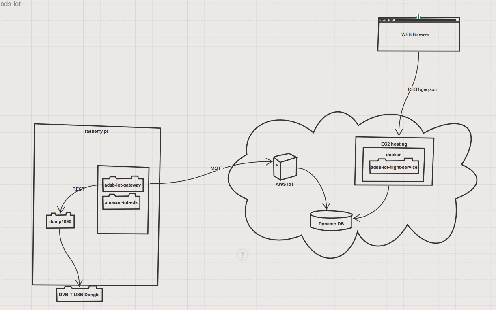
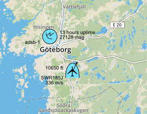

# adsb-iot
ADSB data from an DVB-T recevier to the cloud using AWS IoT and presented on a dynamic map in your browser.

It is possible to receive [ADSB](https://en.wikipedia.org/wiki/Automatic_dependent_surveillance_–_broadcast) using a DVB-T recevier. This project started as a Raspberrypi experiment, where ADSB was receveived on the device. It then expanded to publish the received information using Amazon AWS IoT and storing the information in DynamoDB tables. 

The result is produced as geojson by a microservice running in a docker container on Amazon AWS EC2. 
([running flight service](http://flight-service.brolien.eu/flights))

The microservice is consumed by a javascript webpage and presented on a map 
([check here](http://adsb-iot-web-frontend.s3-website-us-west-2.amazonaws.com))

The Software consists of three functions, each in different github repositories:
- [adsb-iot-gateway](https://github.com/anders-brolien/adsb-iot-gateway)
- [adsb-iot-flight-service](https://github.com/anders-brolien/adsb-iot-flight-service)
- [adsb-iot-web-fontend](https://github.com/anders-brolien/adsb-iot-web-frontend)

CI is performed by snap-ci, status can be seen [here](https://snap-ci.com/dashboard?view=tile):
- the static webpages are pushed to a AWS S3 bucket. 
- the gateway is built and pushed to another AWS S3 bucket from which the Raspberry PI cyclicly fetches the latest release. 
- the flight service is built and a docker image is pushed to the repository. 
- left to do is auto updating of the AWS EC2 instance after update of docker image 
 

 
